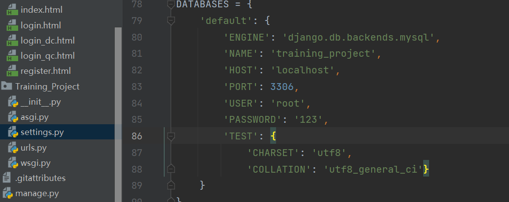
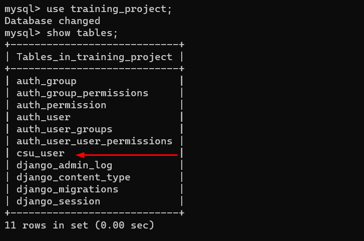
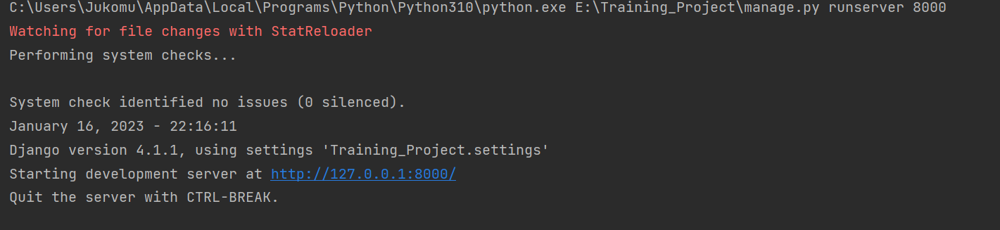
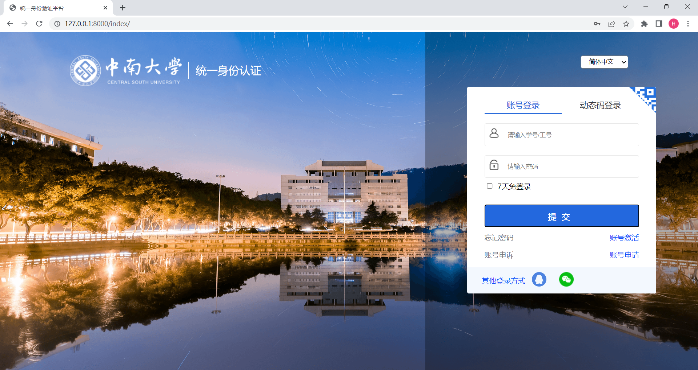
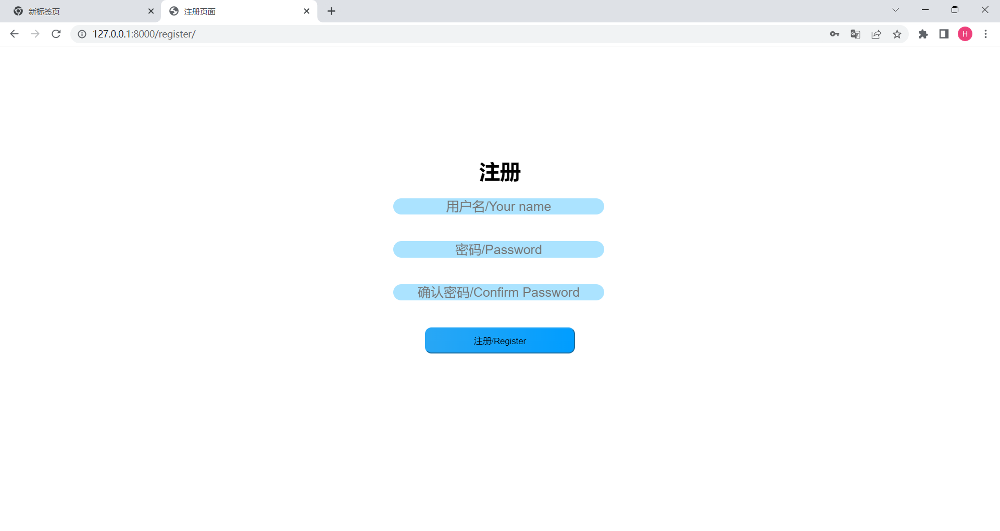
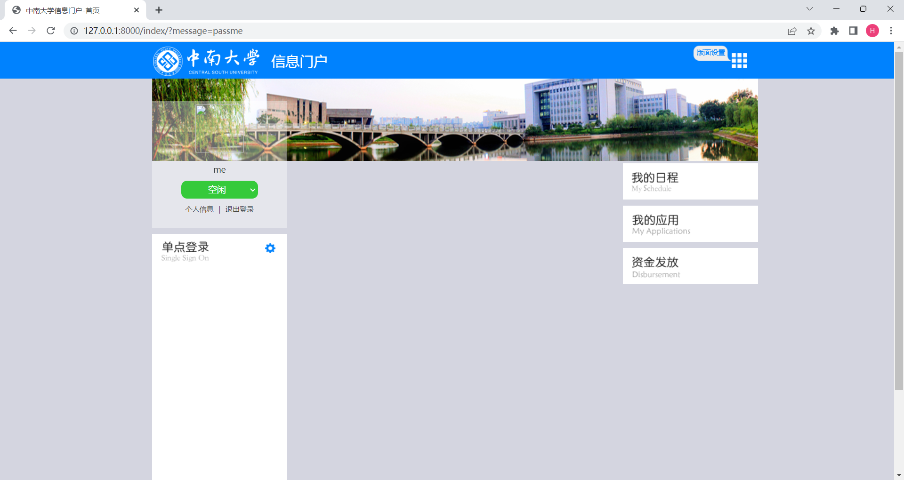

# Training_Project

## 实现的功能
* ### 较为美观的界面,尽可能仿照了官网,简化了一部分页面结构
* ### 注册和登录
  * 注册时具备在本地验证(Js)和后端的验证的功能(Python),保证注册的正确性
  * 登录时需填写完整信息才可提交(Js)和后端查询数据库验证功能(Python)
* ### 登录的信息传递和防未登录
  * 通过后端函数将用户信息(keyword:username)传递给主页
  ```python 
  def login(request):
    ....
    return HttpResponseRedirect('/index/?message=pass'+username)
  ```
  * 通过传递的信息保护验证字段(keyword:pass)，可禁止未登录用户访问主页

<br>

---
## 使用
### 1.设置数据库
* ##### 在settings.py中找到DATABASES设置  


* ##### NAME 对应数据库的名字，数据库需自行创建  
* ##### PORT 对应数据库端口  
* ##### PASSWORD 修改成数据库的密码
　　
</br>

---

### 2.创建数据表
* #### 在终端运行下列命令创建数据表
```
python manage.py makemigrations
python manage.py migrate
```
* #### 创建完成后可查看


<br>

---

### 3.启动Django框架
* #### 命令行输入(xxxx为指定端口)
```
python manage.py runserver xxxx
```
* #### 启动成功




<br>

---

### 4.查看页面
* #### 浏览器输入http://127.0.0.1:xxxx/login/  (这里图片以8000为例。已预先设置了测试账号，用户名：me，密码：1)



* #### 浏览器输入http://127.0.0.1:8000/register/ ，进入账号注册，注册成功即可使用注册账号登录



* #### 进入主页




