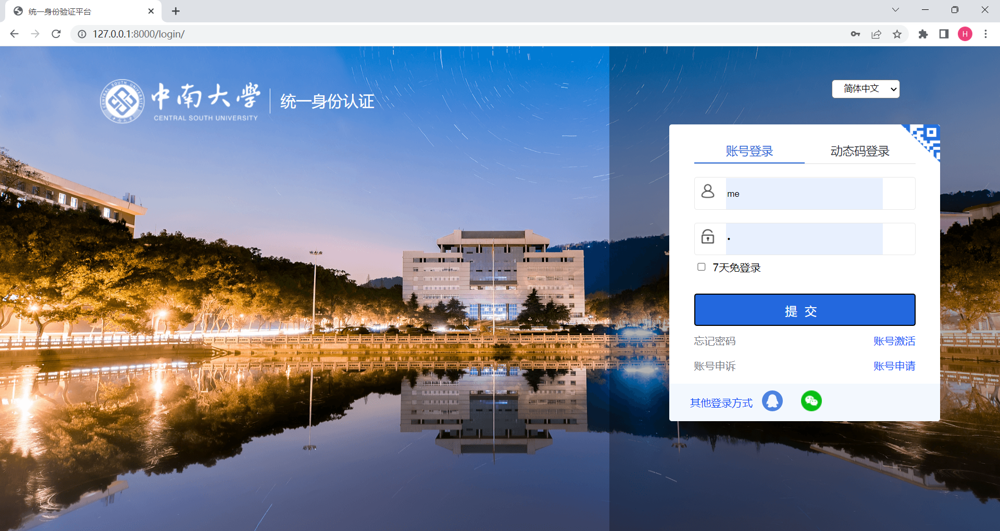

# Training_Project


## 设置数据库
* ### 在settings.py中找到DATABASES设置


* ### NAME 对应数据库的名字，数据库需自行创建
* ### PORT 对应数据库端口
* ### PASSWORD 修改成数据库的密码

## 创建数据表
* ### 在终端运行下列命令创建数据表
```
python manage.py makemigrations
python manage.py migrate
```
* ### 创建完成后可查看


## 启动Django框架
* ### 命令行输入(xxxx为指定端口)
```
python manage.py runserver xxxx
```
* ### 启动成功


* ### 浏览器输入http://127.0.0.1:xxxx/login/  (这里图片以8000为例。已预先设置了测试账号，用户名：me，密码：1)



* ### 浏览器输入http://127.0.0.1:8000/register/ ，进入账号注册，注册成功即可使用注册账号登录(主页未完成)


